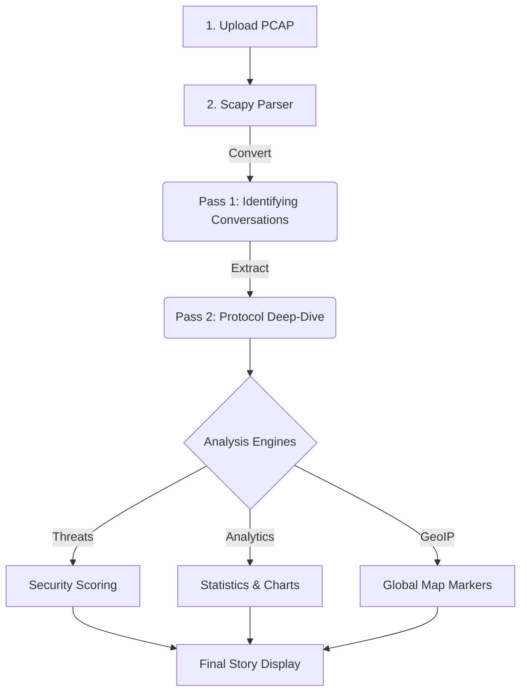

# 00 | 🌟 Introduction & Problem Statement

Welcome to **PCAP StoryTeller**. Before we look at the code, we need to understand *why* this project exists and the major problem it solves in the world of cybersecurity.

---

## 🚩 The Problem: "Data Overload"
Network forensics is the art of investigating cybercrimes by looking at network traffic. However, there is a massive problem: **Traditional tools were built for experts, not students.**

### 🕵️ The "Wireshark" Problem
Wireshark is the most popular tool for looking at network data, but it has three major issues for beginners:
1.  **Too Much Noise**: A 30-second capture can have 50,000 packets. Students get lost in the sea of data.
2.  **No "Story"**: Wireshark shows you individual packets (the "Envelopes"), but it doesn't show you the "Conversation." It's hard to see who started the talk and why.
3.  **Boring UI**: It looks like a complex spreadsheet from the 1990s. It doesn't help you *visualize* the attack.

---

## 💡 The Solution: PCAP StoryTeller
We built this app to turn that mess of data into a **Human-Readable Story**.

### How we make it better:
- **Automatic Linking**: Our backend automatically connects a DNS query to its TCP connection. You don't have to guess; we draw the arrow for you.
- **Heuristic Intelligence**: Instead of you searching for hackers, our app scans the behavior for you and gives you a "Risk Score."
- **Visual Dashboard**: We use interactive charts, security alerts, and a global map to make the data feel "alive."

---

## 🚀 High-Level Pipeline (The Big Picture)

Here is how a raw file becomes an interactive story on your screen:

---

## 🎯 Why is this important?
In cybersecurity, **speed is everything.** If a hack is happening, an investigator needs to understand the "Story" in minutes, not hours. By simplifying the data, we help students learn faster and help professionals find attacks more efficiently.

> [!IMPORTANT]
> **Key Mantra**: 
> "Don't just look at packets—read the story behind them."
