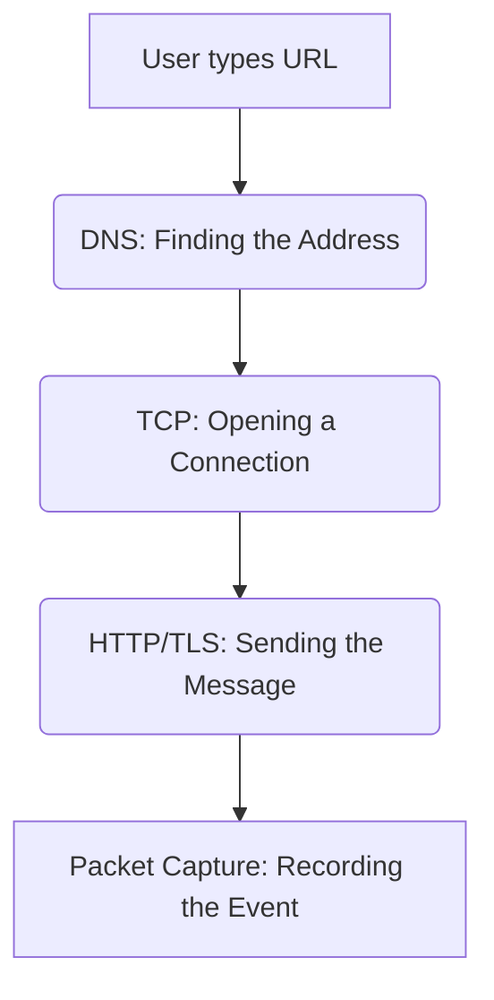

# 01 | 📖 Definitions & Terminology

Welcome to your first step in learning network forensics! Before we dive into the code, we need to understand the "Language of the Network."

---

## 🏗️ The Basics: How Data Moves
Think of the internet like a giant postal system.

1.  **PCAP (Packet Capture)**:
    - *Simple Word*: A "Digital Recording."
    - *Definition*: A file that records every single piece of data (packets) that flew through a network. It's like a CCTV recording, but for data.
2.  **Packet**:
    - *Simple Word*: An "Envelope."
    - *Definition*: A small chunk of data. When you send an image, it is chopped into thousands of tiny packets, sent over the wire, and put back together at the end.
3.  **IP Address**:
    - *Simple Word*: A "Mailing Address."
    - *Definition*: A unique number (like `192.168.1.1`) that identifies a device on a network.

---

## 🚦 Protocols: The "Rules" of the Road
Every packet follows a specific set of rules called a **Protocol**.

| Protocol | What it does | Real-World Analogy |
| :--- | :--- | :--- |
| **DNS** | Turns names (`google.com`) into IPs (`8.8.8.8`) | A Phonebook |
| **HTTP** | Used to fetch unencrypted websites | A Postcard (Everyone can read it) |
| **TLS/HTTPS** | Encrypted web browsing | A Locked Safe in the mail |
| **TCP** | Ensures data arrives in the right order | A Registered Letter (Requires signature) |
| **ICMP** | Used for testing if a computer is "awake" | Calling out "Hello?" to see who answers |

---

## 🛡️ Security & Forensics Terms
1.  **Forensics**:
    - The process of looking at evidence (PCAPs) to figure out what happened during a crime or a hack.
2.  **Heuristics**:
    - "Smart Rules." Instead of looking for a specific virus name, we look for *behavior* (like a computer knocking on 100 doors in 1 second).
3.  **Port**:
    - *Simple Word*: A "Door."
    - *Definition*: A number that tells the data which program to go to. (e.g., Port 80 is the door for Web Browsing).

---

## 📊 The Visualization
Here is how these terms fit together:

> [!NOTE]
> You don't need to memorize these! You will see them in action as we explore the dashboard and the code files.
