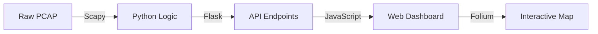

# 02 | 🛠️ Tech Stack & Flask Libraries

To build a professional cybersecurity tool like **PCAP StoryTeller**, we use a combination of powerful libraries. This document explains "What" we use and "Why" we use it, in simple words.

---

## 🐍 The Programming Language: Python
We use **Python** because it is the "Gold Standard" for cybersecurity and data science. It has the best libraries for reading network packets and handling complex data.

---

## 🌐 The Web Framework: Flask
**Flask** is our backend "Server." It acts as the bridge between our Python logic and the user's web browser.

### 📚 key Flask Libraries We Use:
1.  **Flask (Core)**: 
    - *Purpose*: Handles the "Routes" (like `/api/analytics`). When you click a button in the app, Flask is what receives that click and sends back the data.
2.  **Flask-Blueprint**:
    - *Purpose*: Helps us organize code. Instead of one giant file, we use Blueprints to keep API logic separate from other parts of the app.
3.  **Flask-CORS**:
    - *Purpose*: Security. It allows our frontend (the website) to safely talk to our backend server.

---

## 📡 The Forensic Libraries (The "Magic")
These libraries are what actually "see" inside the data.

1.  **Scapy (`rdpcap`)**:
    - *Purpose*: This is the most important library. It reads the raw `.pcap` files and translates them into Python objects we can understand.
2.  **Folium**:
    - *Purpose*: Generates the interactive maps. It takes our IP addresses and "pins" them onto a real-world map using GPS coordinates.
3.  **ReportLab**:
    - *Purpose*: Used to build the PDf reports. It's like a "digital typewriter" for Python.
4.  **Python-Docx**:
    - *Purpose*: Similar to ReportLab, but for Microsoft Word files.

---

## 🎨 The Frontend Stack
Even though we focus on the backend, here is what makes the dashboard look premium:
- **Vanilla JavaScript**: Handles the interactive charts and real-time updates.
- **D3.js / Chart.js**: Used for the beautiful networking graphs and statistics.
- **Glassmorphism CSS**: The modern, translucent look of the boxes.

---

## 🚀 The Data Pipeline Flow
Here is the high-level technology chain:

> [!TIP]
> **Why Flask and not Django?**
> We chose Flask because it is "lightweight." For a tool like this, we don't need a heavy database system; we just need a fast, modular way to serve our analysis results.
