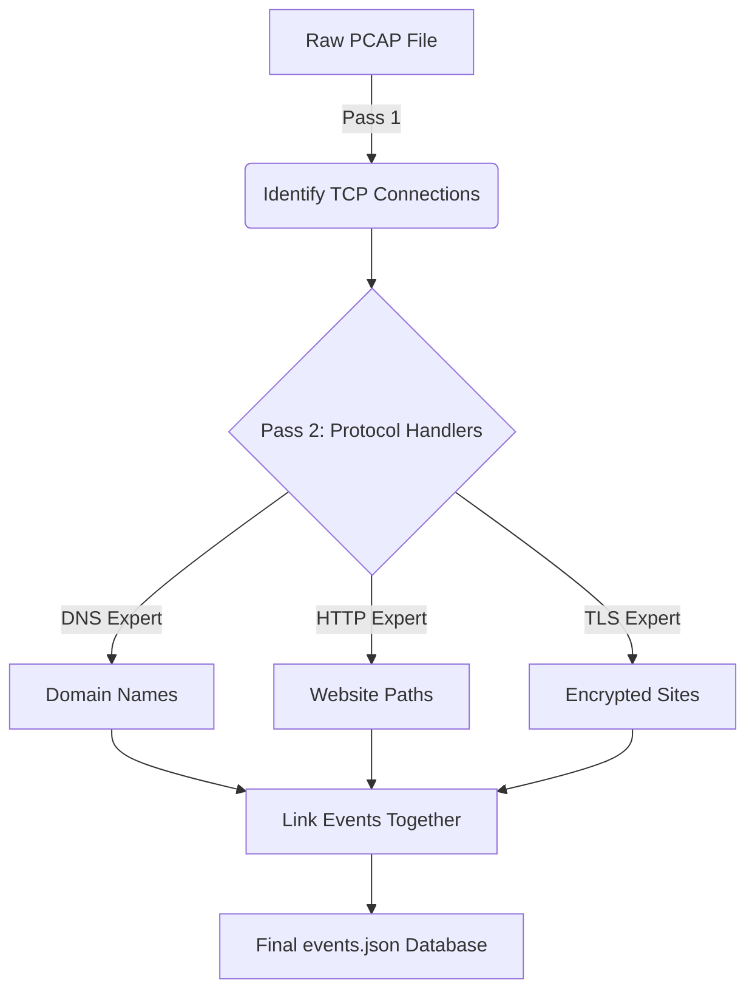
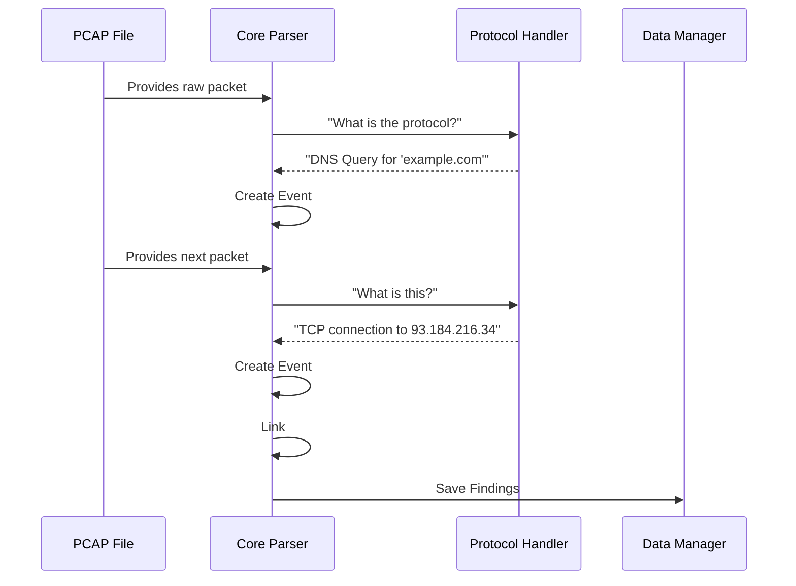

# 03 | 🛠️ Parsing Pipeline Deep-Dive

The **Parser** is the engine of PCAP StoryTeller. It takes a raw, messy **PCAP file** (which is just binary data) and turns it into a structured, interactive **Story**.

---

## 🔄 The 2-Pass Pipeline
To make the analysis smart, we don't just read the file once. We use a **2-Pass Approach**.

### Pass 1: Finding the "Conversations" (Flows)
In Pass 1, we look specifically for `TCP SYN` packets. 
- *Analogy*: Imagine walking into a party and writing down every time two people shake hands to start a conversation.
- *Technical*: We extract the `Source IP`, `Source Port`, `Dest IP`, and `Dest Port`. This becomes a "Flow Key."

### Pass 2: Extracting the "Content"
Now that we know who is talking, we look *inside* the packets to see what they are saying.
- *Analogy*: Eavesdropping on the conversations you identified in Pass 1.
- *Actions*: We look for DNS queries, HTTP website paths, and TLS website names.

---

## 🎨 The Technical Flowchart

---

## 🔗 How We "Link" Events
Linking is what makes this project special. If a computer asks for `google.com` (DNS) and then connects to an IP address (TCP), we draw an arrow between them.

---

## 📂 Where to find the code?
- `backend/parsers/pcap_parser.py`: The main conductor coordinating Pass 1 and Pass 2.
- `backend/parsers/protocol_handlers.py`: The individual "Experts" for DNS, HTTP, and TLS.
- `backend/parsers/parser_utils.py`: Helper tools for cleaning up binary data.

> [!TIP]
> **Simple Coding Tip**: 
> Notice how we use **Static Methods** in `protocol_handlers.py`? This makes the code very modular—you can add a "New Protocol Expert" without breaking the rest of the parser!
