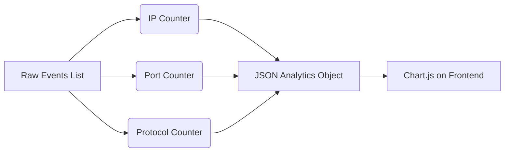

# 04 | 📊 Analytics & Statistics

This service takes the thousands of raw events we parsed and turns them into clean numbers and charts for the Dashboard.

---

## 📈 The Aggregation Process
Aggregation is the process of "Counting and Grouping." 

1.  **Top Talkers**: We count how many times each IP appears as a "Sender."
2.  **Port Distribution**: We count which "Doors" (Ports) are being used the most (e.g., is most traffic web traffic on Port 80?).
3.  **Protocol Mix**: What percentage of the capture is DNS vs. TCP vs. HTTP?

---

## 🎨 Data Visualization Flow

---

## 📂 Key Files
- `backend/services/analytics_service.py`: The logic for counting and sorting the statistics.

> [!TIP]
> **Performance Note**: 
> Notice we use a `defaultdict` in Python for counting. This is much faster than checking if a key exists every single time!
