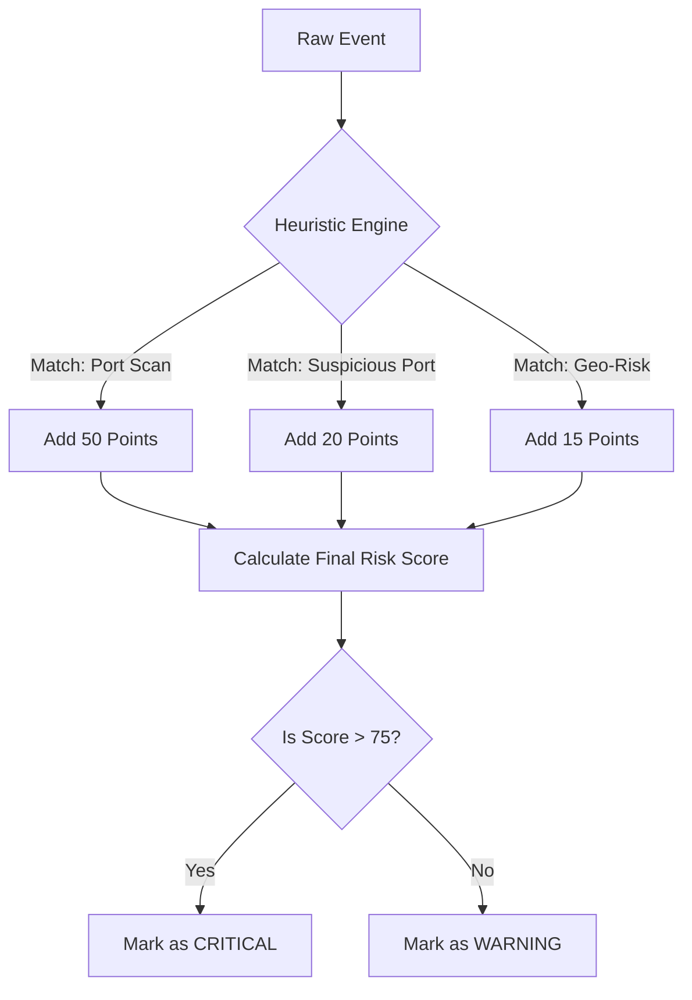

# 05 | 🛡️ Threat Detection & Heuristics

The **Threat Service** is the "Forensic Detective" of the project. Its job is to look at the patterns of communication and decide if something suspicious is happening.

---

## ❓ Why Analyze Behavior?
In the real world, hackers constantly create new viruses that antivirus software might not recognize. However, **hacker behavior** rarely changes. They always need to:
1.  Scan for "open doors" (Port Scanning).
2.  Steal data through quiet channels (DNS Tunneling).
3.  Connect to unknown, suspicious countries.

By looking for these *patterns* instead of specific file names, we can find "Zero-Day" (unknown) attacks.

---

## 🧠 The "Smart" Rules (Heuristics)

### 🔌 Rule 1: Port Scanning
If a single computer tries to connect to more than **10 unique ports** on the same destination in a short time, it is highly likely they are searching for a vulnerability.
- **Severity**: HIGH (Score +50)

### 📡 Rule 2: DNS to Direct Connection
Normal computers use DNS to find an IP, then connect to it. However, if they connect to an IP that was *never* searched for via DNS, or if they send a weirdly long DNS query, it might be data theft.
- **Severity**: MEDIUM (Score +30)

---

## 📊 The Scoring Engine
We use a mathematical approach to calculate the "Risk Score" for every IP address.

---

## 📂 Key Files to Teach
- **`threat_analyzer.py`**: The brain that runs the mathematical scoring.
- **`threat_heuristics.py`**: The list of "Red Flag" behaviors we look for.
- **`threat_service.py`**: The orchestrator that manages the whole process.

> [!IMPORTANT]
> **Teaching Tip**: 
> Remind students that a high score doesn't *always* mean a hack is happening—it just means the behavior is "Interesting" and needs a human investigator to check it out!
