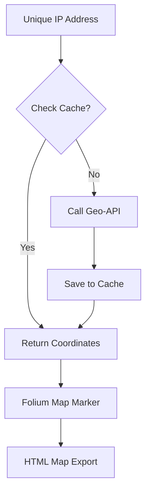

# 06 | 🗺️ Geolocation & Mapping

Where in the world is the traffic coming from? This service finds the physical coordinates of every IP address.

---

## 🌍 The Dual-API Strategy
Because some free APIs have limits, we use two different sources to find the location:
1.  **ipinfo.io**: Our primary source.
2.  **ip-api.com**: Our backup source.

---

## 🗺️ How the Map is Built
We use a library called **Folium** (which uses Leaflet.js) to generate a beautiful interactive map.

---

## 📂 Key Files
- `backend/services/geoip_scanner.py`: Handles the actual API calls and caching.
- `backend/services/geolocation_service.py`: Orchestrates lookups for multiple IPs.
- `backend/services/map_service.py`: The Folium logic for drawing the interactive map.
