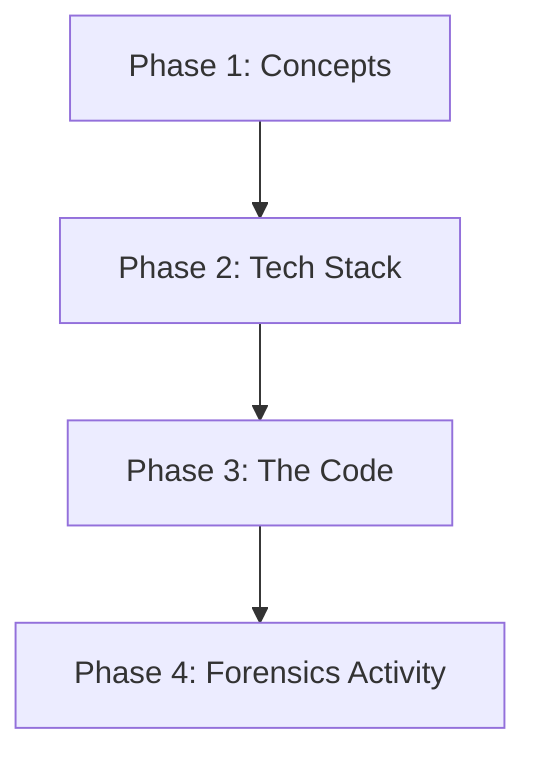

# 08 | 🎓 Teaching Flow & Curriculum

This document provides high-level guidance for teachers on how to explain the project in a classroom setting.

---

## 📅 The 4-Stage Teaching Flow

### Stage 1: The "What" and "Why" (Definitions)
- **File**: `01_Definitions_and_Terminology.md`
- **Key Lesson**: Explain that the internet is just thousands of "postcards" (packets).
- **Activity**: Show a raw PCAP file on screen—it looks like gibberish. Explain that our project is the "Magic Glasses" that makes it readable.

### Stage 2: The Tech Stack (The Tools)
- **File**: `02_Tech_Stack_and_Flask_Libraries.md`
- **Key Lesson**: Why we choose specific tools. Python is the detective, Scapy is the magnifying glass, and Flask is the storytelling engine.

### Stage 3: The Engine Room (Parsing & Logic)
- **Files**: `03_Parsing_Pipeline_Deep_Dive.md`, `04_Analytics.md`
- **Key Lesson**: The 2-Pass Pipeline. Show how we find a conversation first, then listen to the details.
- **Activity**: Open `pcap_parser.py` and point out the `Pass 1` and `Pass 2` comments.

### Stage 4: Playing the Detective (Cybersecurity)
- **Files**: `05_Threat_Detection.md`, `06_Mapping.md`
- **Key Lesson**: Behavior is more important than signatures.
- **Activity**: Upload a suspicious PCAP and watch the "Risk Score" climb!

---

## 🎨 Knowledge Flow Diagram

> [!TIP]
> **Educator Note**: 
> Always start with the visual dashboard before showing the code. Once students are "Wowed" by the UI, they will be much more interested in learning how the Python backend created that magic!
