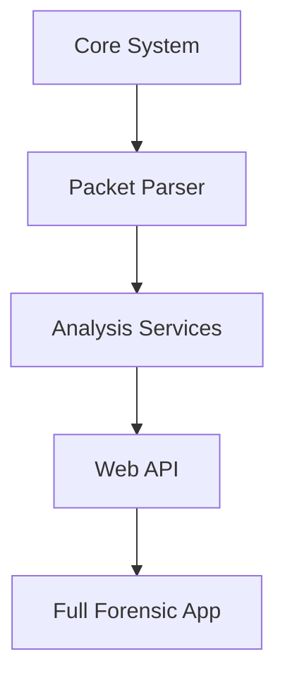

# 09 | 🏗️ Development Roadmap (Scratch to Success)

If you were to build this project from zero, this is the order you should follow. This "Roadmap" helps students understand how modular software is built step-by-step.

---

## 🛠️ Step-by-Step Development Order

### Phase 1: The Foundation (Core Backend)
1.  **File**: `backend/core/config.py` - Set up your folder paths.
2.  **File**: `backend/core/logger.py` - Create the "Black Box" to track errors.
3.  **File**: `backend/data/data_manager.py` - Create the "Brain" to save your results.

### Phase 2: The Investigator (The Parser)
4.  **File**: `backend/parsers/parser_utils.py` - Tools for cleaning binary data.
5.  **File**: `backend/parsers/protocol_handlers.py` - Write your first "Protocol Expert" (e.g., DNS).
6.  **File**: `backend/parsers/pcap_parser.py` - The conductor that brings everyone together.

### Phase 3: The Intelligence (Services)
7.  **File**: `backend/services/analytics_service.py` - Count and group the data.
8.  **File**: `backend/services/threat_analyzer.py` - Write your first "Hacker Detection" rule.
9.  **File**: `backend/services/geoip_scanner.py` - Add mapping capabilities.

### Phase 4: The Interface (API)
10. **File**: `backend/api/api_routes.py` - Open the "Web Doors" (Endpoints).
11. **File**: `backend/app.py` - Start the engine and run the server!

---

## 📊 The Construction Pipeline

> [!IMPORTANT]
> **Why this order?**
> We start with the **Data Manager** and **Logger** because if you can't save your data or see your errors, you can't build anything else! We build the "Brain" before the "Body."
